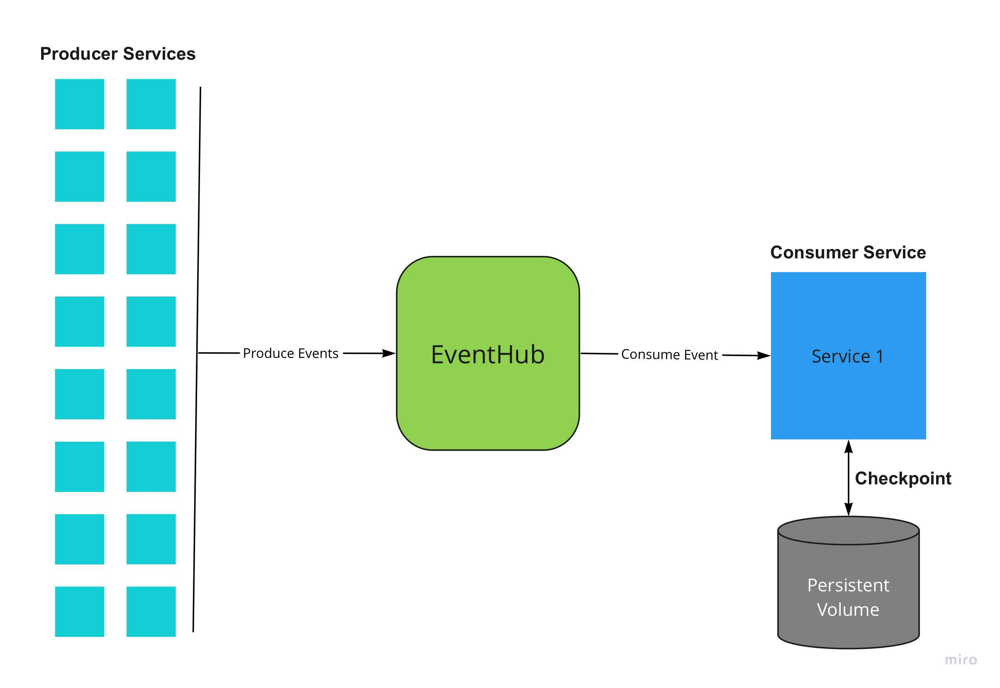

# Azure Eventhubs Local Checkpoint Store

Dependancy: `azure-eventhub=5.10.0`

## Introduction
The default Azure SDK for python comes with the ability to checkpoint Azure EventHub events to the Azure Blob Storage only. However, it does not provide the implementation to save the EventHub checkpoint object to a local/mounted file system. This project aims to provide that functionality by utilising the CheckpointStore Abstract Base Class provided in the SDK 

## Checkpointing vs No Checkpointing

## Samples

Here are some sample code examples with helper scripts to run a dummy listener with checkpointing and a producer script with which you can test the checkpointing. The environment variables need to be set properly in order for the scripts to work. These scripts serve the purpose of show casing the usage and are **NOT** to be used in any production environment as is!

1. [sample_consume_event_with_local_checkpointing_async.py](./sample/sample_consume_event_with_local_checkpointing_async.py)
2. [sample_produce_event_async.py](./sample/sample_produce_event_async.py)